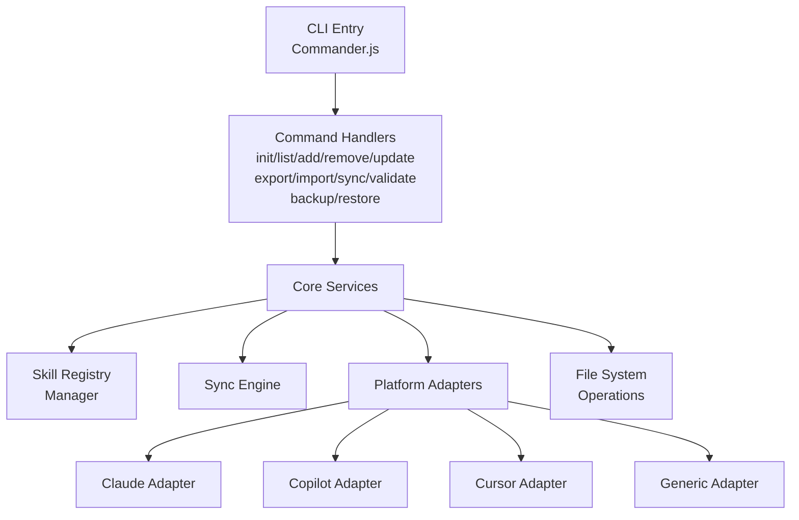

# AI Skill Manager CLI - Technical Design Specification

Feature Name: ai-skill-manager
Updated: 2026-04-14

## Description

`ai-skill-manager` 是一个基于 Node.js/TypeScript 的命令行工具，用于统一管理和同步多种 AI 工具（Claude、GitHub Copilot、Cursor 等）的 skill 配置。核心特性包括：

- 本地文件系统的 skill 注册表管理
- 多平台 skill 配置的导入导出
- 支持符号链接的轻量级同步机制
- 完整的备份和恢复功能

## Architecture



### Directory Structure

```
ai-skill-manager/
├── src/
│   ├── commands/           # 命令实现
│   │   ├── init.ts
│   │   ├── list.ts
│   │   ├── add.ts
│   │   ├── remove.ts
│   │   ├── update.ts
│   │   ├── export.ts
│   │   ├── import.ts
│   │   ├── sync.ts
│   │   ├── validate.ts
│   │   ├── backup.ts
│   │   └── restore.ts
│   ├── core/               # 核心服务
│   │   ├── registry.ts     # 注册表管理
│   │   ├── sync-engine.ts  # 同步引擎
│   │   └── index.ts
│   ├── adapters/           # 平台适配器
│   │   ├── base.ts         # 适配器基类
│   │   ├── claude.ts       # Claude 适配器
│   │   ├── copilot.ts      # GitHub Copilot 适配器
│   │   ├── cursor.ts       # Cursor 适配器
│   │   └── index.ts
│   ├── types/              # 类型定义
│   │   └── index.ts
│   ├── utils/              # 工具函数
│   │   ├── file.ts
│   │   ├── validation.ts
│   │   └── index.ts
│   └── index.ts            # 入口文件
├── package.json
├── tsconfig.json
└── README.md
```

## Components and Interfaces

### 1. CLI Entry (src/index.ts)

入口文件，使用 Commander.js 解析命令行参数并分发到对应命令处理器。

**主要职责：**
- 定义全局选项 (`--help`, `--version`, `--registry-path`)
- 注册所有子命令
- 初始化日志和错误处理

### 2. Command Handlers (src/commands/)

每个命令对应一个独立的处理器文件。

**接口约定：**
```typescript
interface CommandHandler {
  execute(args: any, options: any): Promise<CommandResult>;
}

interface CommandResult {
  success: boolean;
  message?: string;
  data?: any;
}
```

**命令列表：**
| 命令 | 描述 | 核心逻辑 |
|------|------|---------|
| init | 初始化注册表 | 调用 RegistryManager.createRegistry() |
| list | 列出 skill | 调用 RegistryManager.listSkills() |
| add | 添加 skill | 调用 RegistryManager.addSkill() |
| remove | 删除 skill | 调用 RegistryManager.removeSkill() |
| update | 更新 skill | 调用 RegistryManager.updateSkill() |
| export | 导出 skill | 调用 RegistryManager.exportSkill() |
| import | 导入 skill | 调用 RegistryManager.importSkill() |
| sync | 同步 skill | 调用 SyncEngine.sync() |
| validate | 验证格式 | 调用 ValidationUtils.validate() |
| backup | 备份所有 | 调用 RegistryManager.backupAll() |
| restore | 恢复备份 | 调用 RegistryManager.restoreAll() |

### 3. Skill Registry Manager (src/core/registry.ts)

核心注册表管理服务。

**主要职责：**
- 读写本地注册表文件 (registry.json)
- 维护 skill 的增删改查操作
- 处理文件路径解析

### 4. Sync Engine (src/core/sync-engine.ts)

同步引擎，处理与各平台的同步逻辑。

**主要职责：**
- 选择合适的 Platform Adapter
- 执行 push/pull/link 操作
- 管理符号链接创建

### 5. Platform Adapters (src/adapters/)

适配不同 AI 工具平台的配置文件格式。

**适配器基类接口：**
```typescript
abstract class BaseAdapter {
  abstract platform: string;
  abstract configPaths: string[];
  
  abstract parse(content: string): SkillConfig;
  abstract stringify(config: SkillConfig): string;
  abstract supportsSymlink(): boolean;
  
  getConfigPath(platform: string): string;
}
```

## Data Models

### SkillRegistry

```typescript
interface SkillRegistry {
  version: string;           // 注册表版本，如 "1.0.0"
  createdAt: string;         // ISO 8601 时间戳
  updatedAt: string;         // ISO 8601 时间戳
  skills: Skill[];           // skill 列表
}
```

### Skill

```typescript
interface Skill {
  id: string;               // 唯一标识符 (UUID)
  name: string;             // skill 名称 (全局唯一)
  platform: string;          // 目标平台 (claude/copilot/cursor/generic)
  configPath: string;        // 配置文件相对路径
  metadata: SkillMetadata;   // 元数据
}

interface SkillMetadata {
  description?: string;     // skill 描述
  tags?: string[];          // 标签
  createdAt: string;        // 创建时间
  updatedAt: string;        // 更新时间
  source?: string;           // 来源信息
}
```

### PlatformConfig

```typescript
interface PlatformConfig {
  platform: string;
  name: string;
  configBasePath: string;    // 平台配置根目录
  skillSubPath: string;      // skill 配置子目录
  supportedFormats: string[]; // 支持的文件格式
  supportsSymlink: boolean;  // 是否支持符号链接
}
```

## Supported Platforms

| 平台 | 配置路径 | 格式 | 符号链接支持 |
|------|---------|------|------------|
| claude | ~/.claude/skills/ | JSON | 是 |
| copilot | ~/.github/copilot/ | JSON | 是 |
| cursor | ~/.cursor/settings/ | JSON | 是 |
| generic | 用户指定 | JSON/YAML | 取决于文件系统 |

## Correctness Properties

### 注册表一致性

1. **唯一性约束**：注册表中每个 skill 的名称必须全局唯一
2. **引用完整性**：注册表中的 configPath 指向的文件必须存在
3. **平台有效性**：每个 skill 的 platform 必须是支持的平台之一

### 同步正确性

1. **双向转换一致性**：对于同一 skill，`push` 后再 `pull` 应得到相同内容
2. **符号链接有效性**：创建的符号链接必须指向真实存在的文件
3. **幂等性**：对同一目标多次执行相同同步操作应得到相同结果

### 文件操作原子性

1. **注册表更新原子性**：修改注册表时应先写入临时文件再原子重命名
2. **备份完整性**：备份操作要么成功所有文件，要么全部回滚

## Error Handling

### 错误类型

```typescript
enum ErrorCode {
  REGISTRY_NOT_FOUND = 'REGISTRY_NOT_FOUND',
  REGISTRY_ALREADY_EXISTS = 'REGISTRY_ALREADY_EXISTS',
  SKILL_NOT_FOUND = 'SKILL_NOT_FOUND',
  SKILL_ALREADY_EXISTS = 'SKILL_ALREADY_EXISTS',
  INVALID_FORMAT = 'INVALID_FORMAT',
  PLATFORM_NOT_SUPPORTED = 'PLATFORM_NOT_SUPPORTED',
  FILE_SYSTEM_ERROR = 'FILE_SYSTEM_ERROR',
  SYMLINK_NOT_SUPPORTED = 'SYMLINK_NOT_SUPPORTED',
  PERMISSION_DENIED = 'PERMISSION_DENIED',
}
```

### 错误处理策略

| 错误类型 | 用户可见性 | 处理策略 |
|---------|----------|---------|
| REGISTRY_NOT_FOUND | 是 | 提示使用 `init` 命令创建 |
| SKILL_NOT_FOUND | 是 | 提示检查 skill 名称 |
| INVALID_FORMAT | 是 | 显示详细错误位置和原因 |
| FILE_SYSTEM_ERROR | 是 | 提供具体系统错误信息 |
| PERMISSION_DENIED | 是 | 提示检查文件权限 |

## Command Specifications

### init

```typescript
command: 'init [path]'
options:
  --force    // 如果已存在则覆盖
```

### list

```typescript
command: 'list'
options:
  --platform <name>   // 按平台过滤
  --json              // JSON 输出格式
```

### add

```typescript
command: 'add <name> --platform <platform> --file <path>'
options:
  --inline <content>  // 内联 JSON 内容
  --description <desc>
  --tags <tags...>
```

### sync

```typescript
command: 'sync <platform>'
options:
  --push              // 本地到平台
  --pull              // 平台到本地
  --link              // 使用符号链接
  --dry-run           // 预览模式
```

## Test Strategy

### 单元测试

使用 Vitest 进行单元测试，覆盖核心模块：

- `core/registry.ts` - 注册表 CRUD 操作
- `core/sync-engine.ts` - 同步逻辑
- `adapters/*.ts` - 各平台适配器
- `utils/*.ts` - 工具函数

### 集成测试

使用 Node.js `child_process` 执行实际命令，验证：

- CLI 命令解析和分发
- 文件系统操作的正确性
- 多平台适配器协同工作

### 测试覆盖目标

| 模块 | 覆盖率目标 |
|------|----------|
| core/registry.ts | >= 90% |
| core/sync-engine.ts | >= 85% |
| adapters/*.ts | >= 80% |
| commands/*.ts | >= 70% |

## Dependencies

### Runtime Dependencies

| 包 | 版本 | 用途 |
|----|------|-----|
| commander | ^12.0.0 | CLI 参数解析 |
| chalk | ^5.0.0 | 命令行彩色输出 |
| fs-extra | ^11.0.0 | 文件系统操作增强 |
| js-yaml | ^4.0.0 | YAML 格式解析 |
| conf | ^12.0.0 | 配置文件管理 |

### Development Dependencies

| 包 | 版本 | 用途 |
|----|------|-----|
| typescript | ^5.0.0 | TypeScript 编译 |
| vitest | ^1.0.0 | 单元测试框架 |
| @types/node | ^20.0.0 | Node.js 类型定义 |

## References

[^1]: (Website) - [Commander.js Documentation](https://github.com/tj/commander.js)
[^2]: (Website) - [Node.js fs-extra](https://github.com/jprichardson/node-fs-extra)
[^3]: (Website) - [Vitest Testing Framework](https://vitest.dev)
